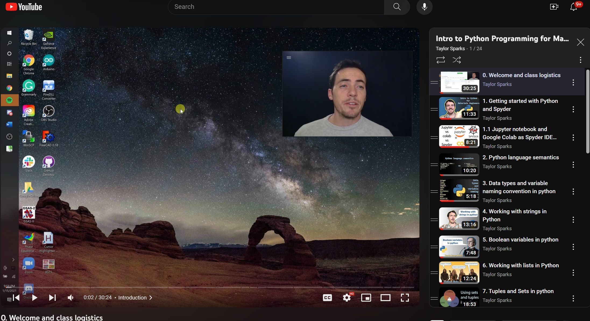

# MSE2001python
This github repo contains coursework content such as class slides, code notebooks, homework assignments, literature, and more for MSE 2001 "Materials Informatics" taught at the University of Utah in the Materials Science & Engineering department. 

The whole course can be watched at the following YouTube playlist 
https://youtu.be/aoL3whRmSfc 

